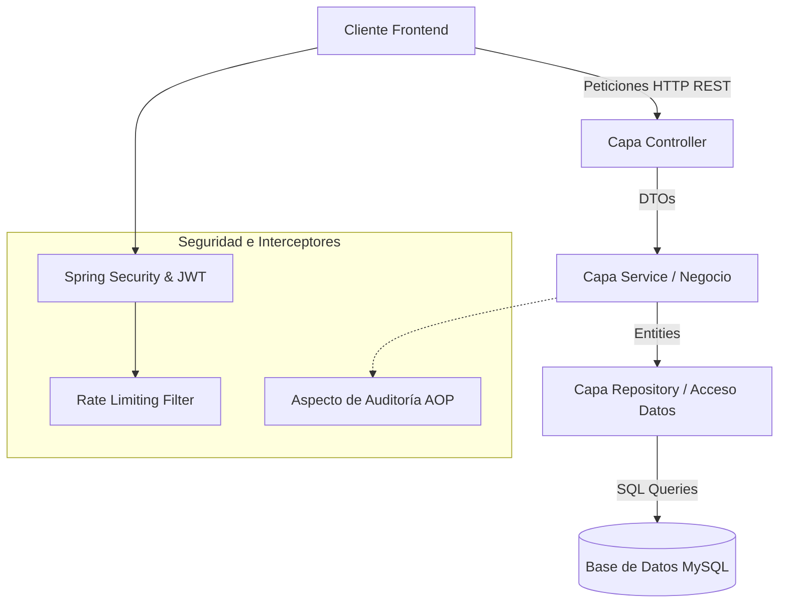

# Arquitectura del Backend ☕🍃

El backend de **SIGA Modern** está desarrollado utilizando **Java 21** y **Spring Boot 3**. Sigue un patrón de arquitectura limpia dividida en capas lógicas (N-Tier Architecture), exponiendo una API REST robusta y segura.

---

## 🏗️ Organización de Capas

El código está estructurado en el paquete raíz `com.siga` de la siguiente forma:

### 1. Capa de Controladores (`controller`)
Expone los endpoints del API REST en formato JSON. Se encarga de validar los datos de entrada y delegar a la capa de servicio.
*   *Controladores principales*: `AuthController`, `ConsultaController`, `AnimalController`, `MedicamentoController`, `TurnoController`, `AuditoriaController`.

### 2. Capa de Servicios (`service`)
Implementa las reglas y lógica de negocio del sistema veterinario. Es la capa transaccional.
*   *Servicios principales*: `ConsultaService`, `MedicamentoService`, `StorageService` (para subir estudios médicos), `RecetaPdfService` (para exportar PDF).

### 3. Capa de Acceso a Datos (`repository`)
Interfaces que extienden `JpaRepository` de Spring Data JPA. Permiten interactuar con la base de datos sin escribir SQL manual en la mayoría de los casos.
*   *Repositorios principales*: `UserRepository`, `ConsultaRepository`, `MedicamentoRepository`, `TurnoRepository`, `AuditRepository`.

### 4. Capa de Entidades (`entity`)
Clases Java anotadas con `@Entity` de JPA que representan las tablas de la base de datos relacional.
*   *Mapeos clave*: Relaciones `@ManyToOne` (ej. Animal a Dueño), `@OneToMany` (ej. Consulta a Receta/Medicamentos).

---

## 🔒 Mecanismos Cruzados (Cross-cutting Concerns)

*   **Seguridad**: Gestionada por **Spring Security** y un filtro JWT personalizado (`JwtAuthenticationFilter`). Valida la firma del token en la cookie HttpOnly y puebla el contexto de seguridad.
*   **Auditoría AOP**: Mediante AspectJ (`AuditAspect`), se interceptan llamadas transaccionales de modificación/borrado en la capa de servicios para registrar automáticamente en base de datos quién realizó la acción, cuándo y qué método se ejecutó. Ver `[[modulo_auditoria]]`.
*   **Rate Limiting**: Filtro servlet (`RateLimitingFilter`) que aplica un algoritmo Token Bucket para prevenir ataques DoS o fuerza bruta (ej. máximo 5 logins por minuto). Ver `[[modulo_seguridad]]`.
