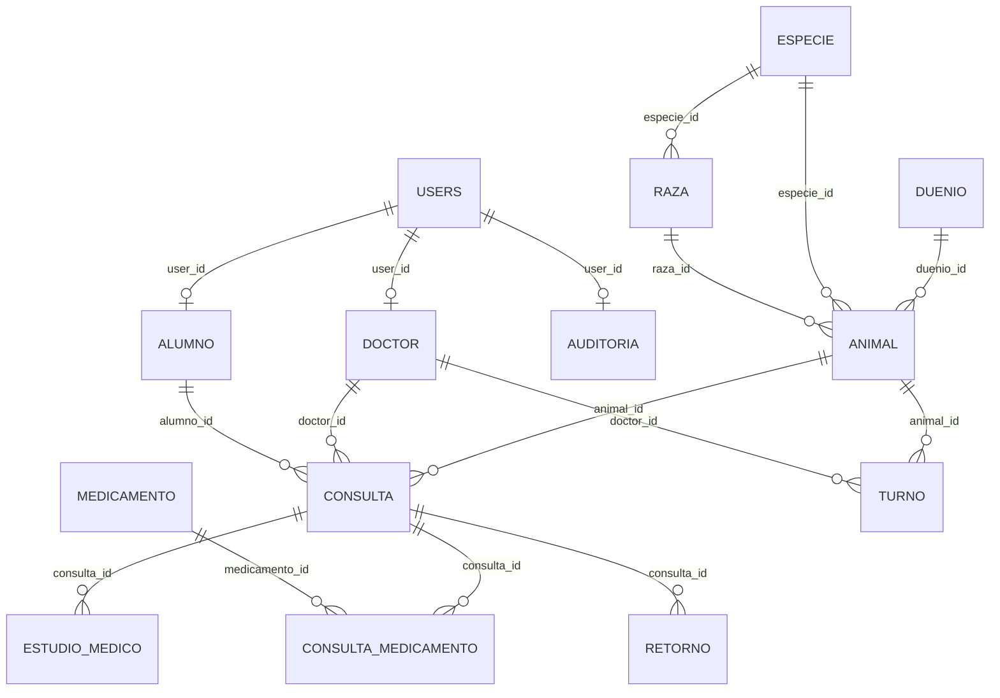

# Arquitectura de Base de Datos 🗄️🐋

El almacenamiento y persistencia del sistema **SIGA Modern** está a cargo de un servidor relacional **MySQL 8** (corriendo dentro del entorno contenedorizado de Docker). 

---

## 📐 Esquema de Tablas e Interrelaciones

El diseño de base de datos está normalizado y mapea las siguientes entidades:

### 1. Gestión de Cuentas y Roles
*   `users`: ID, username, email, password (BCrypt), roles (`ADMIN`, `DOCTOR`, `ALUMNO`), enabled, created_at.
*   `doctor`: ID, user_id, dni, nombre, apellido, email, matrícula.
*   `alumno`: ID, user_id, dni, nombre, apellido, email, matrícula.

### 2. Estructura de Pacientes y Clientes
*   `duenio`: Datos de contacto del dueño. Permite asociar múltiples mascotas.
*   `animal`: Mascota registrada. Contiene peso, fecha de nacimiento, sexo, color, dueño, especie y raza.
*   `lista_especie` / `lista_raza`: Tablas catálogo para especies y razas.

### 3. Fichas Clínicas e Interacciones
*   `consulta`: Registra la atención veterinaria (anamnesis, signos vitales, diagnóstico y tratamiento).
*   `retorno` / `derivacion`: Controles posteriores o envío a especialistas externos.
*   `estudio_medico`: Almacena el historial de archivos cargados (PDF, imágenes) vinculados a una consulta.
*   `peso_registro`: Registra la evolución histórica de peso de una mascota.
*   `turno`: Citas programadas vinculando animal, veterinario y motivo.

### 4. Farmacia e Inventario
*   `medicamento`: Stock disponible, umbral mínimo de alerta y datos del fármaco.
*   `consulta_medicamento`: Tabla intermedia (receta) que asocia los medicamentos recetados y dosificados en cada consulta.

---

## 🛡️ Seguridad y Restricciones
*   **Restricciones de Integridad**: Borrados en cascada limitados para evitar la pérdida accidental de historias clínicas históricas.
*   **Limpieza de Datos**: El tamaño de campos de texto extensos en `consulta` se optimizó para no exceder las limitaciones físicas de registro (`Row size too large`) en motores InnoDB de MySQL.
