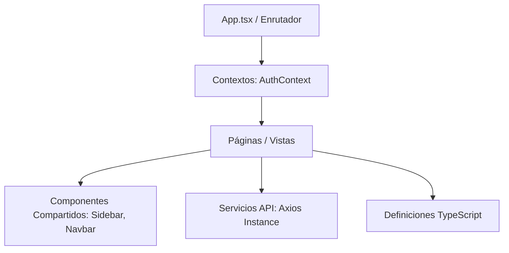

# Arquitectura del Frontend ⚛️⚡

El frontend de **SIGA Modern** está desarrollado utilizando **React 18** con **TypeScript**, compilado y servido de forma ultrarrápida usando **Vite**, y estilizado con **Tailwind CSS** para un diseño moderno, responsivo y de alto rendimiento.

---

## 🏗️ Organización del Código (`frontend/src`)

El código fuente en el frontend se organiza bajo la carpeta `src/` de acuerdo a su propósito y responsabilidad:

### 1. Páginas (`pages`)
Representan las vistas principales asociadas a una ruta del enrutador React.
*   *Vistas clave*: `Login`, `Dashboard`, `Animales` (incluye ficha clínica e historia), `ConsultaDetail` (gestión de recetas y archivos de estudios), `Turnos` (calendario semanal), `Auditorias`, `Farmacia`.

### 2. Componentes Compartidos (`components`)
Elementos de interfaz de usuario reutilizables que mantienen consistencia de diseño en toda la aplicación.
*   *Navbar.tsx*: Barra superior premium con efecto backdrop-blur, badge de rol con color dinámico y avatar con las iniciales del usuario.
*   *Sidebar.tsx*: Menú lateral de navegación persistente con ocultamiento dinámico de links según roles (ej. oculta Auditorías a los Alumnos).

### 3. Contexto de Estado (`context`)
Maneja el estado global de la aplicación, principalmente la autenticación del usuario.
*   *AuthContext.tsx*: Gestiona el estado de login, parseo del token JWT y el **Controlador de Inactividad de 10 Minutos** que expira la sesión de forma segura si el usuario no interactúa con la página.

### 4. Servicios de API (`services`)
Capa de comunicación con el backend que encapsula las llamadas HTTP.
*   *api.ts*: Instancia configurada de **Axios** que incluye de forma automática las credenciales en cookies HttpOnly (`withCredentials: true`) y gestiona los códigos de error globales (ej. redirección al login ante un HTTP 401).

---

## 🎨 Diseño y Estilos

*   **Tailwind CSS**: Permite estilar la aplicación mediante clases de utilidad directamente en el HTML/TSX, facilitando layouts flexibles, transiciones suaves e interactividad responsiva.
*   **Ajustes de Usabilidad por Rol**: El frontend oculta controles y botones de edición/creación cuando el usuario logueado tiene el rol de `ALUMNO` (quienes solo pueden consultar la base de datos).
