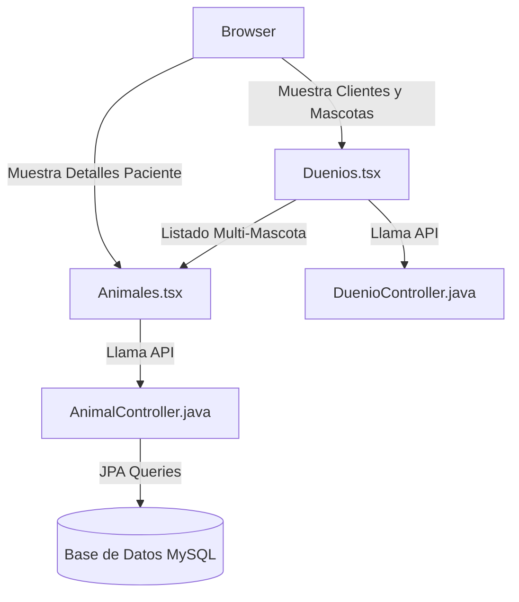

# Módulo de Pacientes y Clientes 🐾👥

Este módulo gestiona la información de las mascotas (pacientes) y sus dueños (clientes), modelando relaciones complejas y aplicando límites de acceso basados en el rol del usuario logueado.

---

## 🛠️ Componentes Clave

### 1. Gestión Multi-Mascota
*   **Asociación de Entidades**: El sistema soporta relaciones uno-a-muchos entre un dueño (`Duenio.java`) y múltiples mascotas (`Animal.java`).
*   **Frontend**: La vista `[[Duenios|Duenios.tsx]]` muestra dinámicamente las mascotas ligadas a cada cliente mediante etiquetas visuales enriquecidas y accesos rápidos a las fichas clínicas individuales.

### 2. Catálogo de Especies y Razas
*   El sistema cuenta con catálogos estructurados (`Especie.java` y `Raza.java`) para estandarizar el registro clínico.
*   En la vista de edición de `[[Animales|Animales.tsx]]`, la selección de razas está anidada dinámicamente y se filtra al seleccionar la especie correspondiente (ej. Perro, Gato, Caballo).

### 3. Límites de Acceso por Roles (Alumnos vs. Veterinarios)
*   **Restricción Frontend**: Para garantizar que los alumnos no modifiquen registros core de pacientes o dueños, el frontend oculta dinámicamente los botones "Nuevo Dueño", "Nuevo Animal", así como las acciones de edición y eliminación si el rol detectado es `ALUMNO`.
*   **Restricción Backend**: Se aplican anotaciones `@PreAuthorize("hasAnyRole('ADMIN', 'DOCTOR')")` en las operaciones de escritura (POST, PUT, DELETE) de `AnimalController.java` y `DuenioController.java`. Si un alumno intenta evadir el frontend enviando la petición directa, el backend la deniega con HTTP `403 Forbidden`.

---

## 🔗 Conexiones del Grafo
*   *Parte del*: **[[siga_system|Sistema Core]]**
*   *Conecta con*: **[[modulo_consultas]]**, **[[modulo_turnos]]**, **[[database_architecture]]**
