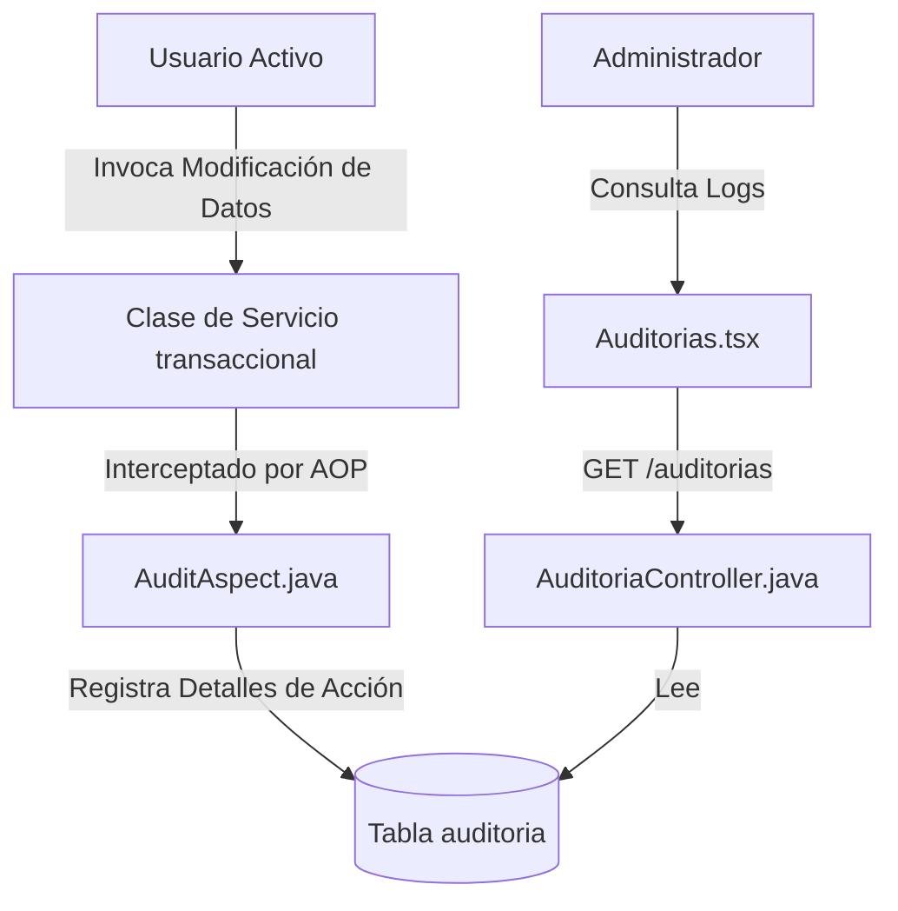

# Módulo de Logs y Auditoría 📝🛡️💼

Este módulo proporciona trazabilidad y control sobre cualquier cambio crítico realizado en los datos de la clínica (creación, edición o eliminación), ayudando en la auditoría de seguridad y la rendición de cuentas de los usuarios.

---

## 🛠️ Mecanismo de Auditoría Automatizado (AOP)

### 1. Intercepción AOP (Programación Orientada a Aspectos)
*   **Backend**: Implementado mediante AspectJ en `AuditAspect.java`.
*   **Mecanismo**: El aspecto intercepta de forma automática y transparente la ejecución de métodos críticos en la capa de servicios (como `create*`, `update*`, `delete*`).
*   **Datos Capturados**: Al ejecutarse el método, el aspecto extrae:
    - El nombre del método ejecutado.
    - El nombre de usuario logueado en el hilo de ejecución (mediante Spring Security Context).
    - La marca de tiempo exacta.
    - El detalle de los parámetros enviados.
    - Registra esta información insertando una fila en la tabla de base de datos `auditoria`.

### 2. Vista de Auditorías (`Auditorias.tsx`)
*   **Frontend**: Página premium de `[[Auditorias|Auditorias.tsx]]`. Permite al administrador e inspectores autorizados listar las auditorías registradas, filtrar por usuario, filtrar por fecha o rango, y ver los detalles técnicos completos del log en un modal.

### 3. Delegación Granular de Permisos
*   Los logs de auditoría son información sensible. Por defecto, solo los administradores (`ADMIN`) tienen acceso.
*   **Autorización a Doctores**: Un administrador puede editar la ficha de un **Doctor** en la pantalla de `[[Usuarios|Usuarios.tsx]]` y activar la casilla de "Autorizar acceso a Logs de Auditoría" (`puedeVerAuditoria`).
*   **Validación del Token**: El backend valida que la propiedad esté activa en las propiedades del usuario autenticado en el controlador `AuditoriaController.java` antes de entregar los datos.

---

## 🔗 Conexiones del Grafo
*   *Parte del*: **[[siga_system|Sistema Core]]**
*   *Conecta con*: **[[modulo_seguridad]]**, **[[database_architecture]]**
