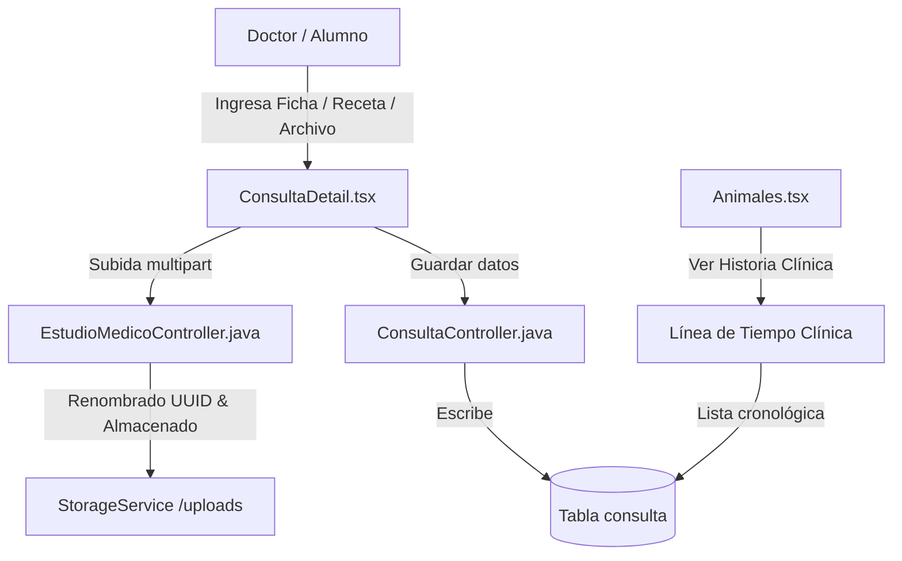

# Módulo de Consultas y Fichas Clínicas 📋🐕🏥

El módulo de **Consultas** es la pieza central del trabajo diario en la clínica. Gestiona el registro detallado de las atenciones médicas, el almacenamiento de estudios clínicos (archivos adjuntos) y recopila la historia clínica del paciente en una línea de tiempo dinámica.

---

## 🛠️ Componentes Clave

### 1. Registro de Consulta (`ConsultaDetail.tsx`)
*   Permite a médicos y alumnos ingresar toda la sintomatología del paciente.
*   Campos clínicos estructurados (anamnesis, signos vitales, exploración por sistemas, diagnósticos presuntivo/diferencial/pronóstico, indicaciones).
*   *Optimización de BD*: El tamaño de campos de texto estándar se configuró a `length = 100` en la entidad `Consulta.java` para evitar problemas de desbordamiento en el motor InnoDB (`Row size too large`).

### 2. Carga y Almacenamiento de Archivos (Estudios Médicos)
*   **Subida segura**: Los doctores y alumnos pueden adjuntar radiografías, informes en PDF o análisis de laboratorios externos en una pestaña dedicada.
*   **Gestión del Servidor**: Los archivos se envían mediante peticiones multiparte al `EstudioMedicoController.java` y son procesados por `StorageService.java`.
    - Se guardan localmente en el directorio `uploads/`.
    - Se renombran usando identificadores aleatorios UUID únicos para evitar colisiones y ataques de inyección de directorios (path traversal).
    - Los registros correspondientes se guardan en la tabla `estudio_medico` vinculada a la consulta.

### 3. Línea de Tiempo de Historia Clínica
*   En la vista de `[[Animales|Animales.tsx]]`, al presionar la acción **"Ver"** en un animal, se carga su ficha clínica interactiva.
*   Muestra una **Línea de Tiempo Clínica** detallada ordenada cronológicamente de forma descendente, que consolida:
    - Consultas generales.
    - Controles de Retorno.
    - Derivaciones.
    - Análisis de Laboratorio.

---

## 🔗 Conexiones del Grafo
*   *Parte del*: **[[siga_system|Sistema Core]]**
*   *Conecta con*: **[[modulo_farmacia]]**, **[[modulo_examenes]]**, **[[database_architecture]]**
