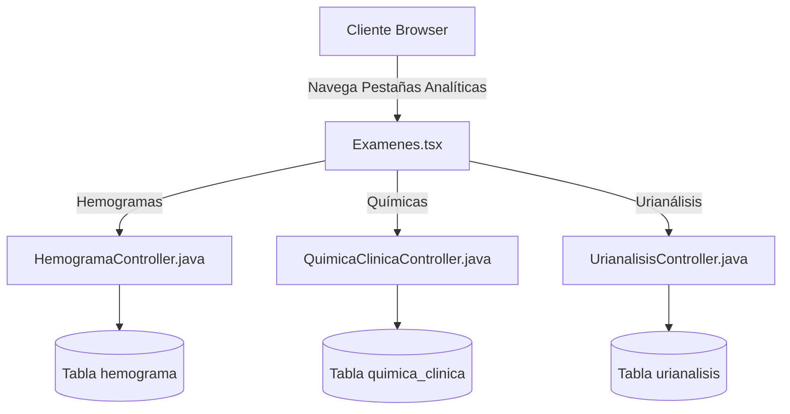

# Módulo de Exámenes de Laboratorio 🧪🔬🩸

Este módulo gestiona la carga y visualización de resultados analíticos de laboratorio clínico veterinario, organizados en tres categorías diagnósticas principales.

---

## 🛠️ Estructura del Módulo

### 1. Interfaz de Pestañas (`Examenes.tsx`)
*   **Pestañas Diagnósticas**: Organiza los registros en tres categorías de fácil navegación:
    1. **Hemograma**: Datos celulares de la sangre (eritrocitos, hemoglobina, hematocrito, leucocitos, reticulocitos, fórmula leucocitaria).
    2. **Química Clínica**: Parámetros metabólicos y enzimáticos (glucemia, uremia, creatinina, fosfatemia, GOT, GPT, CPK, LDH).
    3. **Urianálisis**: Propiedades físicas, químicas e inspección de sedimentos urinarios.

### 2. Mapeos de Base de Datos y Entidades
Las tres entidades de base de datos están vinculadas a la consulta original y al paciente para asegurar la trazabilidad histórica:
*   `Hemograma.java`: Mapea los valores hematológicos y observaciones técnicas.
*   `QuimicaClinica.java`: Mapea la bioquímica del paciente.
*   `Urianalisis.java`: Parámetros como ph, densidad, urobilinógeno, glucosa, cuerpos cetónicos, sangre oculta y sedimentos.

---

## 🔗 Conexiones del Grafo
*   *Parte del*: **[[siga_system|Sistema Core]]**
*   *Conecta con*: **[[modulo_consultas]]**, **[[database_architecture]]**
