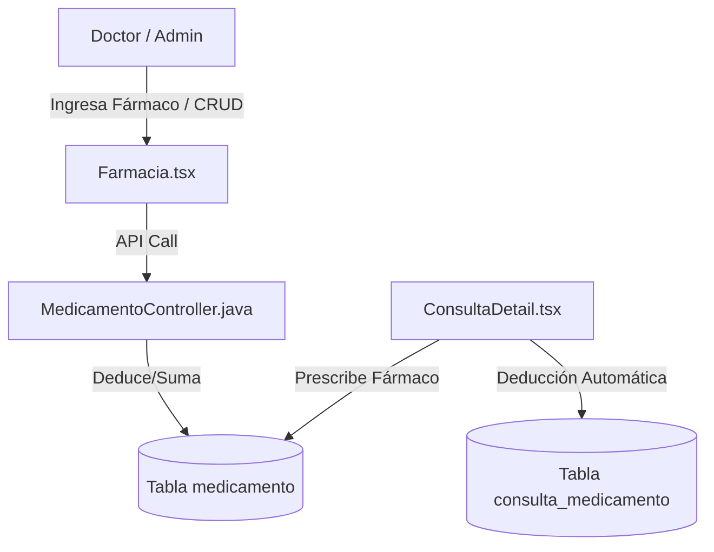

# Módulo de Farmacia y Medicamentos 💊📦

El módulo de **Farmacia** de SIGA Modern permite controlar el stock disponible de fármacos e insumos de la clínica y vincular las recetas directamente a las consultas clínicas, deduciendo automáticamente el inventario en tiempo real.

---

## 🛠️ Componentes Clave

### 1. Gestión de Medicamentos
*   **Frontend**: Vista de `[[Farmacia|Farmacia.tsx]]`. Permite a veterinarios y administradores registrar insumos médicos, definir stock inicial, lote, fecha de vencimiento y umbral mínimo de alertas.
*   **Backend**: `MedicamentoController.java` valida los permisos mediante `@PreAuthorize`. Los administradores y doctores tienen control total, mientras que los alumnos solo pueden listar fármacos de forma segura (lectura).

### 2. Alerta de Stock Mínimo
*   El dashboard y la lista de farmacia evalúan si el stock actual de un medicamento está por debajo del umbral mínimo configurado.
*   Si se activa, el frontend resalta visualmente el registro con alertas llamativas para incentivar el reabastecimiento.

### 3. Integración de Recetas en Consultas
*   Al atender a un paciente en la vista `[[ConsultaDetail|ConsultaDetail.tsx]]`, el veterinario puede prescribir medicamentos detallando la cantidad y dosis.
*   **Deducción Automática de Stock**: En `ConsultaService.java` (backend), cuando se guarda una consulta con medicamentos prescritos:
    - Se verifica si hay stock suficiente.
    - Se resta del stock total en la base de datos la cantidad recetada.
    - Si la consulta es modificada o eliminada, el backend ajusta y restaura el stock automáticamente.

---

## 🔗 Conexiones del Grafo
*   *Parte del*: **[[siga_system|Sistema Core]]**
*   *Conecta con*: **[[modulo_consultas]]**, **[[database_architecture]]**
