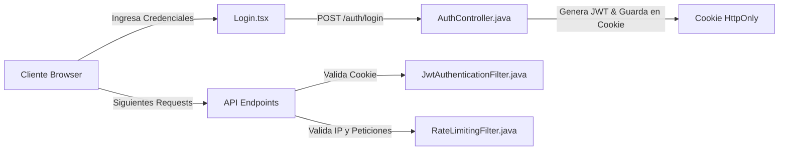

# Módulo de Seguridad y Control 🔐🛡️

Este módulo transversal garantiza que solo los usuarios autorizados operen en el sistema, implementando políticas modernas de mitigación de ataques y control de sesiones.

---

## 🛠️ Componentes Clave

### 1. Autenticación y Token JWT (Cookies HttpOnly)
*   **Backend**: `AuthController.java` expone `/api/v1/auth/login` y `/api/v1/auth/logout`.
    - Al iniciar sesión correctamente, el token JWT se guarda en una **Cookie HttpOnly** llamada `siga_token` (en lugar de guardarlo en `localStorage` o `sessionStorage`).
    - Esto protege la aplicación de ataques de robo de sesión a través de inyecciones de código malicioso (XSS).
*   **Filtro de Autenticación**: `JwtAuthenticationFilter.java` extrae de forma automática la cookie en cada petición HTTP, valida su firma con la clave JWT secreta de 256 bits y carga los detalles en el contexto de seguridad.

### 2. Control de Inactividad (10 Minutos)
*   **Frontend**: Implementado en el `AuthContext.tsx`.
    - Escucha eventos de actividad del ratón, teclado, y clics del usuario.
    - Si pasan **10 minutos** sin interacción, se limpia el token del cliente, se llama a `/auth/logout` para eliminar la cookie segura, y se redirige al usuario a la página de `[[Login|Login.tsx]]` tras una alerta visual.

### 3. Limitación de Peticiones (Rate Limiting)
*   **Token Bucket**: Implementado de forma nativa en la clase `TokenBucket.java` por dirección IP.
*   **Rate Limiting Filter**: `RateLimitingFilter.java` intercepta el flujo HTTP en el servidor:
    - Limita los intentos sobre el login a un máximo de **5 peticiones por minuto** para evitar ataques de fuerza bruta.
    - Limita peticiones generales al API REST a un máximo de **100 peticiones por minuto**.
    - Si se exceden los límites, responde con HTTP `429 Too Many Requests`.

---

## 🔗 Conexiones del Grafo
*   *Parte del*: **[[siga_system|Sistema Core]]**
*   *Conecta con*: **[[backend_architecture]]**, **[[frontend_architecture]]**, **[[database_architecture]]**
