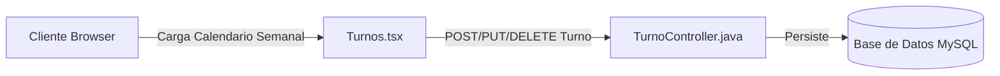

# Módulo de Agenda y Turnos 📅🕒🩺

Este módulo proporciona una agenda interactiva para agendar turnos de pacientes, optimizando la asignación de profesionales veterinarios en la clínica veterinaria universitaria.

---

## 🛠️ Componentes Clave

### 1. Agenda Semanal Interactiva
*   **Frontend**: Vista de `[[Turnos|Turnos.tsx]]`. Presenta un componente de calendario dividido por días de la semana y rangos horarios.
*   Permite navegar de forma interactiva entre semanas (avanzar y retroceder) para visualizar los turnos agendados.

### 2. Reserva y Detalle de Turnos
*   Al hacer clic sobre un horario libre o presionar el botón "Reservar Turno", se despliega un modal interactivo que requiere:
    - Selección del paciente (Animal).
    - Selección del profesional veterinario asignado (Doctor).
    - Fecha y hora específica.
    - Motivo de consulta.
*   Cada turno cuenta con estados de reserva (`RESERVADO`, `COMPLETADO`, `CANCELADO`) que se pueden modificar directamente desde la interfaz.

### 3. Integración en el Backend
*   La entidad `Turno.java` modela las relaciones `@ManyToOne` con `Animal.java` y `Doctor.java`.
*   El controlador `TurnoController.java` valida los datos ingresados para evitar solapamientos de turnos del mismo veterinario y expone los endpoints necesarios para la sincronización con el frontend.

---

## 🔗 Conexiones del Grafo
*   *Parte del*: **[[siga_system|Sistema Core]]**
*   *Conecta con*: **[[modulo_animales_duenios]]**, **[[database_architecture]]**
