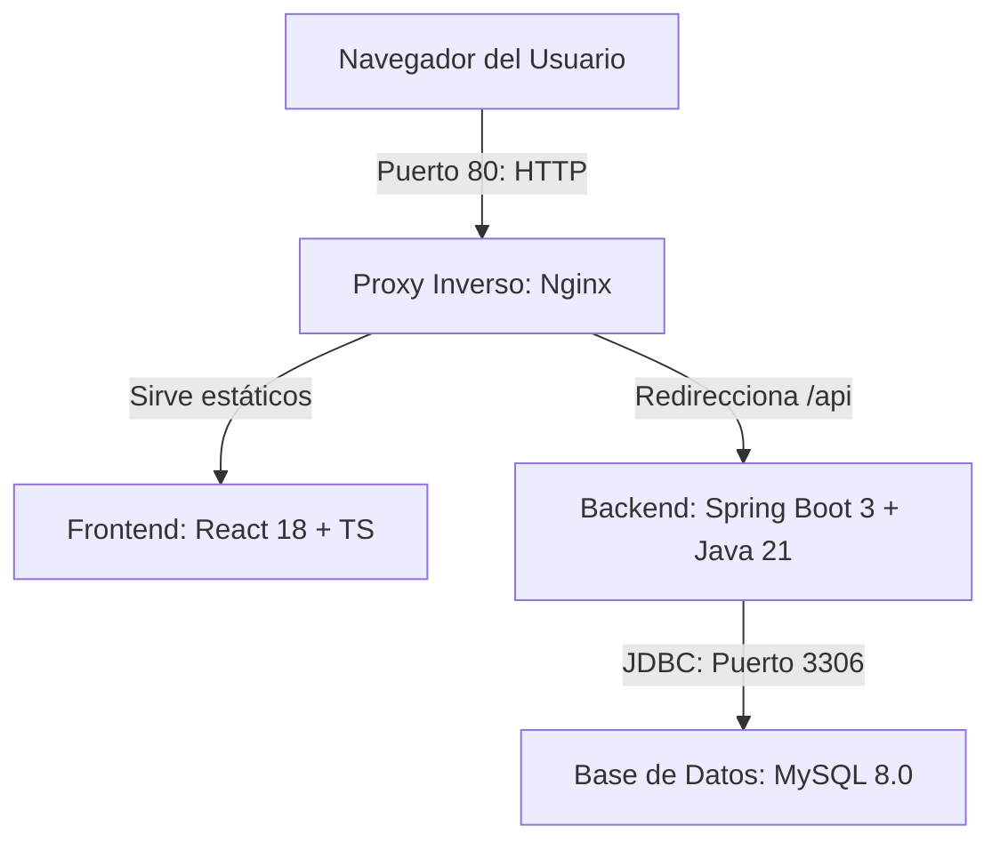
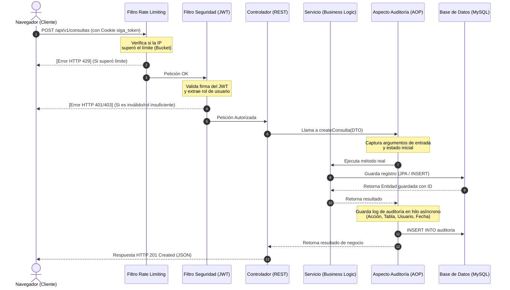
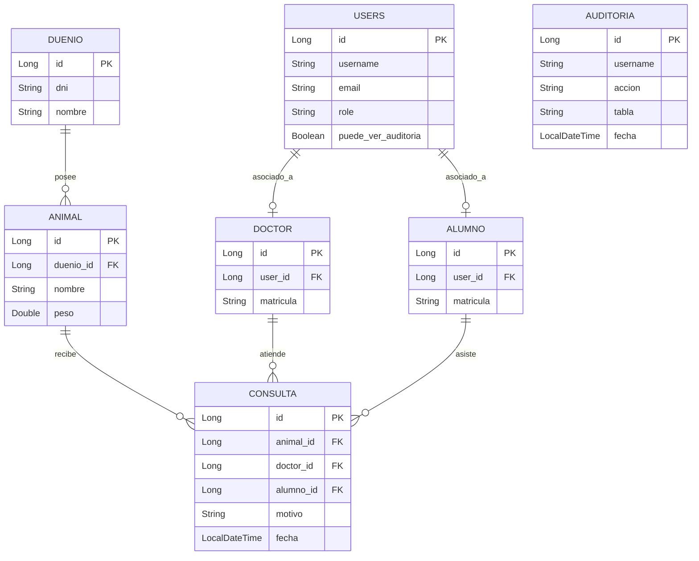

# Dossier Académico y Memoria Técnica — SIGA Modern

Este documento consolida la arquitectura, diseño y medidas de control e ingeniería del sistema **SIGA Modern** (Sistema de Gestión Veterinaria). Ha sido estructurado específicamente para servir como memoria técnica de presentación ante tribunales y autoridades universitarias.

---

## 1. Introducción y Contexto

**SIGA Modern** es una reconstrucción web full-stack de una aplicación de escritorio legacy (Java Swing) utilizada para la gestión clínica en entornos de medicina veterinaria y educación universitaria. El sistema modernizado provee accesibilidad multiusuario y control granular de roles para tres perfiles de usuarios (Administradores, Médicos Veterinarios y Alumnos), facilitando la co-asistencia médica sin comprometer la seguridad e integridad del historial clínico.

---

## 2. Arquitectura de Software

El sistema implementa un patrón **Cliente-Servidor Desacoplado** orquestado mediante contenedores con la siguiente distribución:

### Capas del Backend
El backend sigue el patrón de diseño clásico de capas del ecosistema Spring:
1.  **Capa de Controladores (REST Controllers):** Expone los endpoints, maneja la serialización/deserialización JSON y valida DTOs de entrada.
2.  **Capa de Servicios (Service Layer):** Alberga la lógica de negocio, validaciones del dominio veterinario y transacciones.
3.  **Capa de Acceso a Datos (Repositories):** Interfacea con la base de datos usando Spring Data JPA y Hibernate (ORM).
4.  **Capa de Seguridad (Spring Security):** Filtra peticiones por JWT y realiza el control de acceso basado en roles (`RBAC`).

---

## 3. Patrones de Diseño Implementados

*   **MVC (Modelo-Vista-Controlador):** Implementado mediante la división clara entre el frontend en React (Vista) y el backend Spring Boot (Controlador/Modelo).
*   **Repository Pattern:** Aísla la lógica de acceso a datos encapsulando las consultas SQL detrás de interfaces JPA genéricas.
*   **AOP (Programación Orientada a Aspectos):** Utilizada para desacoplar el logging de auditoría de seguridad del flujo normal de la lógica de negocio.
*   **Token Bucket:** Algoritmo implementado de forma nativa para regular y limitar el consumo de la API (Rate Limiting) previniendo ataques de denegación de servicio.

---

## 4. Ciclo de Vida de una Petición Protegida

El siguiente diagrama detalla cómo se procesa una petición HTTP típica (ej. crear una consulta médica) desde que el cliente la envía hasta que se almacena y audita:

---

## 5. Diseño y Optimización de Base de Datos

### Modelo Entidad-Relación Simplificado

### Optimización por Índices (JPA Indexing)
Se agregaron índices estructurados para optimizar el rendimiento de las consultas y búsquedas bajo alta concurrencia de datos reales:
1.  **`idx_duenio_dni`** (Tabla `duenio`): Optimiza la búsqueda directa de fichas de propietarios por número de documento.
2.  **`idx_animal_nombre` y `idx_animal_duenio`** (Tabla `animal`): Aceleran el filtrado de animales y la carga relacional de mascotas por propietario.
3.  **`idx_consulta_fecha` y `idx_consulta_animal`** (Tabla `consulta`): Clave para el renderizado instantáneo de la línea de tiempo de historia clínica en orden cronológico descendente.
4.  **`idx_auditoria_fecha` y `idx_auditoria_username`** (Tabla `auditoria`): Acelera las búsquedas y filtrados de auditoría por administrador.

---

## 6. Mecanismos de Seguridad Avanzados

1.  **Mitigación de XSS (Cookies HttpOnly):** El JWT no se almacena en el `localStorage` del navegador (donde es vulnerable a scripts inyectados), sino en una cookie HTTP con las flags `HttpOnly` y `Secure`, haciendo que sea inaccesible mediante JavaScript.
2.  **Protección de Stock en Concurrencia (Farmacia):** La deducción de medicamentos prescritos se efectúa en un bloque transaccional controlado por JPA en el backend, evitando inconsistencias de stock (double-spending del inventario).
3.  **Filtro AOP Seguro:** El aspecto de auditoría implementa inspección segura de tipos (`getSafeEntityString`) para evitar bucles de serialización y N+1 query loops comunes al invocar `.toString()` sobre proxies perezosos (Lazy proxies) de Hibernate.
