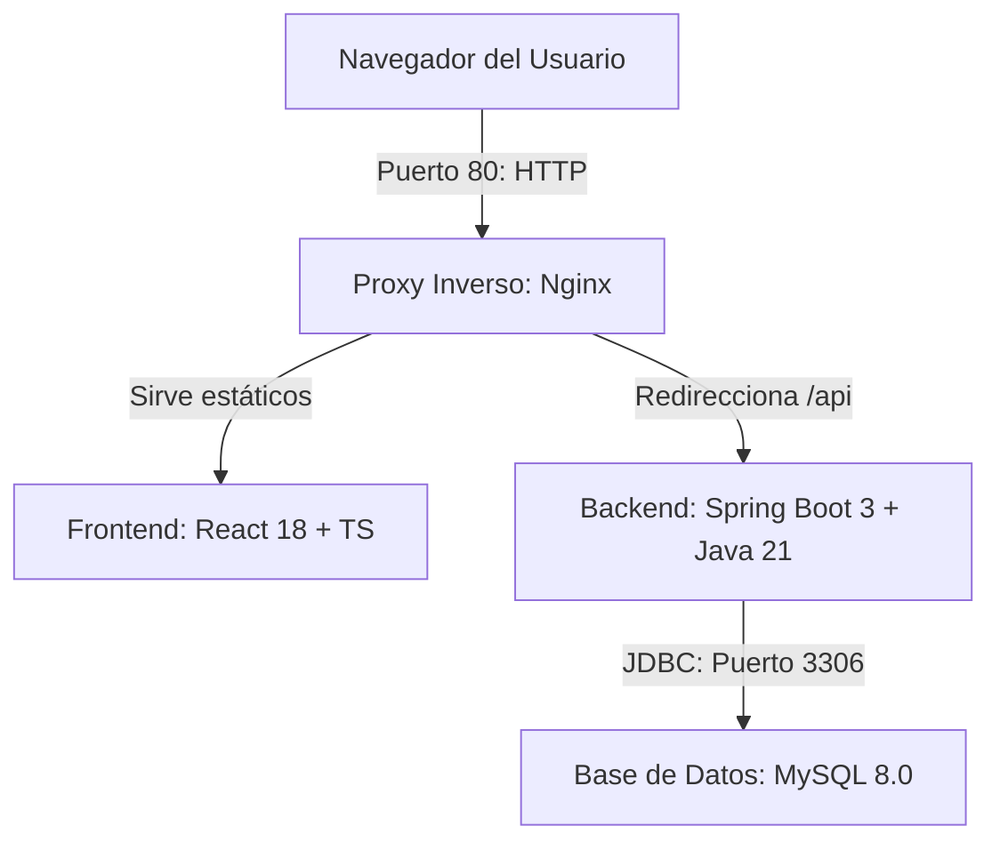
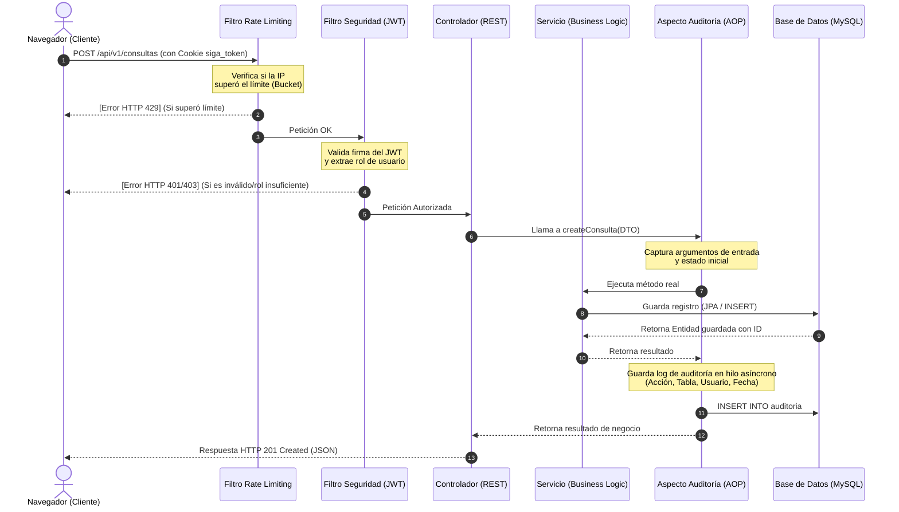
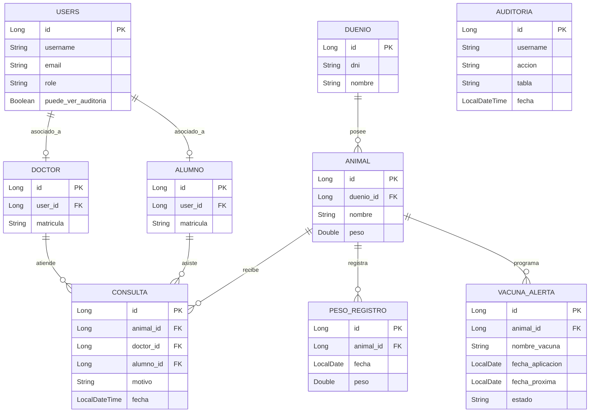

# Dossier Académico y Memoria Técnica — SIGA Modern

Este documento consolida la arquitectura, diseño y medidas de control e ingeniería del sistema **SIGA Modern** (Sistema de Gestión Veterinaria). Ha sido estructurado específicamente para servir como memoria técnica de presentación ante tribunales y autoridades universitarias.

---

## 1. Introducción y Contexto

**SIGA Modern** es una reconstrucción web full-stack de una aplicación de escritorio legacy (Java Swing) utilizada para la gestión clínica en entornos de medicina veterinaria y educación universitaria. El sistema modernizado provee accesibilidad multiusuario y control granular de roles para tres perfiles de usuarios (Administradores, Médicos Veterinarios y Alumnos), facilitando la co-asistencia médica sin comprometer la seguridad e integridad del historial clínico.

### 1.1 Antecedentes y Créditos de la Versión Original

> [!NOTE]
> **Reconocimiento de Autoría y Trabajo de Origen:**
> Este proyecto constituye una modernización tecnológica, reingeniería y rediseño completo del sistema **S.I.G.A. (Sistema de Gestión de Animales)**, desarrollado originalmente en el año 2023 por los autores **Lartigue Alejandro Gabriel** y **Luques Jorge Matías** bajo la tutoría del Lic. Diego Candelero para la **Universidad Nacional de La Rioja (UNLaR) - Sede Chamical**.
> 
> La presente investigación y desarrollo toma como base el relevamiento clínico y la especificación de requisitos originales del S.I.G.A., enfocándose en la migración de su interfaz de escritorio Java 8 (Swing) y base de datos relacional MySQL a un entorno web moderno, desacoplado, seguro y contenerizado bajo estándares contemporáneos.

---

## 2. Arquitectura de Software

El sistema implementa un patrón **Cliente-Servidor Desacoplado** orquestado mediante contenedores con la siguiente distribución:

```mermaid
graph TD
    Client[Navegador del Usuario] -->|Puerto 80: HTTP| Nginx[Proxy Inverso: Nginx]
    Nginx -->|Sirve estáticos| ReactApp[Frontend: React 18 + TS]
    Nginx -->|Redirecciona /api| SpringBoot[Backend: Spring Boot 3 + Java 21]
    SpringBoot -->|JDBC: Puerto 3306| MySQL[Base de Datos: MySQL 8.0]
```

### Capas del Backend
El backend sigue el patrón de diseño clásico de capas del ecosistema Spring:
1.  **Capa de Controladores (REST Controllers):** Expone los endpoints, maneja la serialización/deserialización JSON y valida DTOs de entrada.
2.  **Capa de Servicios (Service Layer):** Alberga la lógica de negocio, validaciones del dominio veterinario y transacciones.
3.  **Capa de Acceso a Datos (Repositories):** Interfacea con la base de datos usando Spring Data JPA y Hibernate (ORM).
4.  **Capa de Seguridad (Spring Security):** Filtra peticiones por JWT y realiza el control de acceso basado en roles (`RBAC`).

---

## 3. Patrones de Diseño Implementados

*   **MVC (Modelo-Vista-Controlador):** Implementado mediante la división clara entre el frontend en React (Vista) y el backend Spring Boot (Controlador/Modelo).
*   **Repository Pattern:** Aísla la lógica de acceso a datos encapsulando las consultas SQL detrás de interfaces JPA genéricas.
*   **AOP (Programación Orientada a Aspectos):** Utilizada para desacoplar el logging de auditoría de seguridad del flujo normal de la lógica de negocio.
*   **Token Bucket:** Algoritmo implementado de forma nativa para regular y limitar el consumo de la API (Rate Limiting) previniendo ataques de denegación de servicio.

---

## 4. Ciclo de Vida de una Petición Protegida

El siguiente diagrama detalla cómo se procesa una petición HTTP típica (ej. crear una consulta médica) desde que el cliente la envía hasta que se almacena y audita:

```mermaid
sequenceDiagram
    autonumber
    actor Cliente as Navegador (Cliente)
    participant RateLimit as Filtro Rate Limiting
    participant SecFilter as Filtro Seguridad (JWT)
    participant Ctrl as Controlador (REST)
    participant Serv as Servicio (Business Logic)
    participant Aspect as Aspecto Auditoría (AOP)
    participant DB as Base de Datos (MySQL)

    Cliente->>RateLimit: POST /api/v1/consultas (con Cookie siga_token)
    Note over RateLimit: Verifica si la IP<br/>superó el límite (Bucket)
    RateLimit-->>Cliente: [Error HTTP 429] (Si superó límite)
    
    RateLimit->>SecFilter: Petición OK
    Note over SecFilter: Valida firma del JWT<br/>y extrae rol de usuario
    SecFilter-->>Cliente: [Error HTTP 401/403] (Si es inválido/rol insuficiente)
    
    SecFilter->>Ctrl: Petición Autorizada
    Ctrl->>Aspect: Llama a createConsulta(DTO)
    
    Note over Aspect: Captura argumentos de entrada<br/>y estado inicial
    Aspect->>Serv: Ejecuta método real
    Serv->>DB: Guarda registro (JPA / INSERT)
    DB-->>Serv: Retorna Entidad guardada con ID
    Serv-->>Aspect: Retorna resultado
    
    Note over Aspect: Guarda log de auditoría en hilo asíncrono<br/>(Acción, Tabla, Usuario, Fecha)
    Aspect->>DB: INSERT INTO auditoria
    
    Aspect-->>Ctrl: Retorna resultado de negocio
    Ctrl-->>Cliente: Respuesta HTTP 201 Created (JSON)
```

---

## 5. Diseño y Optimización de Base de Datos

### Modelo Entidad-Relación Simplificado

```mermaid
erDiagram
    USERS {
        Long id PK
        String username
        String email
        String role
        Boolean puede_ver_auditoria
    }
    DOCTOR {
        Long id PK
        Long user_id FK
        String matricula
    }
    ALUMNO {
        Long id PK
        Long user_id FK
        String matricula
    }
    DUENIO {
        Long id PK
        String dni
        String nombre
    }
    ANIMAL {
        Long id PK
        Long duenio_id FK
        String nombre
        Double peso
    }
    CONSULTA {
        Long id PK
        Long animal_id FK
        Long doctor_id FK
        Long alumno_id FK
        String motivo
        LocalDateTime fecha
    }
    AUDITORIA {
        Long id PK
        String username
        String accion
        String tabla
        LocalDateTime fecha
    }
    PESO_REGISTRO {
        Long id PK
        Long animal_id FK
        LocalDate fecha
        Double peso
    }
    VACUNA_ALERTA {
        Long id PK
        Long animal_id FK
        String nombre_vacuna
        LocalDate fecha_aplicacion
        LocalDate fecha_proxima
        String estado
    }

    USERS ||--o| DOCTOR : "asociado_a"
    USERS ||--o| ALUMNO : "asociado_a"
    DUENIO ||--o{ ANIMAL : "posee"
    ANIMAL ||--o{ CONSULTA : "recibe"
    DOCTOR ||--o{ CONSULTA : "atiende"
    ALUMNO ||--o{ CONSULTA : "asiste"
    ANIMAL ||--o{ PESO_REGISTRO : "registra"
    ANIMAL ||--o{ VACUNA_ALERTA : "programa"
```

### Optimización por Índices (JPA Indexing)
Se agregaron índices estructurados para optimizar el rendimiento de las consultas y búsquedas bajo alta concurrencia de datos reales:
1.  **`idx_duenio_dni`** (Tabla `duenio`): Optimiza la búsqueda directa de fichas de propietarios por número de documento.
2.  **`idx_animal_nombre` y `idx_animal_duenio`** (Tabla `animal`): Aceleran el filtrado de animales y la carga relacional de mascotas por propietario.
3.  **`idx_consulta_fecha` y `idx_consulta_animal`** (Tabla `consulta`): Clave para el renderizado instantáneo de la línea de tiempo de historia clínica en orden cronológico descendente.
4.  **`idx_auditoria_fecha` y `idx_auditoria_username`** (Tabla `auditoria`): Acelera las búsquedas y filtrados de auditoría por administrador.

---

## 6. Mecanismos de Seguridad Avanzados

1.  **Mitigación de XSS (Cookies HttpOnly):** El JWT no se almacena en el `localStorage` del navegador (donde es vulnerable a scripts inyectados), sino en una cookie HTTP con las flags `HttpOnly` y `Secure`, haciendo que sea inaccesible mediante JavaScript.
2.  **Protección de Stock en Concurrencia (Farmacia):** La deducción de medicamentos prescritos se efectúa en un bloque transaccional controlado por JPA en el backend, evitando inconsistencias de stock (double-spending del inventario).
3.  **Filtro AOP Seguro:** El aspecto de auditoría implementa inspección segura de tipos (`getSafeEntityString`) para evitar bucles de serialización y N+1 query loops comunes al invocar `.toString()` sobre proxies perezosos (Lazy proxies) de Hibernate.

---

## 7. Módulos Avanzados de Ingeniería (Fase 2)

### A. Motor de Generación de Recetas Médicas (PDF)
El sistema integra **OpenPDF** en el backend para compilar recetas médicas en formato PDF oficial en tiempo de ejecución. 
*   **Aislamiento de Carga:** El controlador REST recibe la consulta, delega la composición del canvas a `RecetaPdfService` y transmite un flujo binario directo (`byte[]`) con headers `content-disposition` específicos, evitando guardar archivos temporales en disco que consuman almacenamiento de servidor.
*   **Formato Académico:** Estructurado mediante tablas encajadas con bordes delgados, uso de paleta de colores corporativa (Teal) y bloques específicos para la firma digital del médico a cargo.

### B. Módulo de Evolución de Peso (SVG Reactivo)
Soporta el seguimiento clínico del desarrollo físico del animal:
*   **Tratamiento de Datos:** La entidad `PesoRegistro` almacena las lecturas históricas. Al registrar un peso, se dispara un listener de servicio que actualiza de manera coherente el campo estático `peso` en la ficha general de `Animal`, sincronizando el historial clínico.
*   **Representación Visual Interactiva:** Diseñado en el cliente a través de un renderizado SVG reactivo que calcula de manera dinámica los puntos en base al peso mínimo y máximo del animal (`viewBox`), evitando el uso de librerías externas pesadas y optimizando la velocidad de carga de la página.

### C. Alertas de Vacunación y Planificación Asíncrona (Cron Job)
*   **Planificador Asíncrono:** Utiliza la infraestructura `@EnableScheduling` de Spring Framework. A través de la anotación `@Scheduled`, el sistema ejecuta un barrido diario (`cron = "0 0 0 * * ?"`) buscando alertas en estado `PENDIENTE` cuya fecha de refuerzo esté a 3 días o menos.
*   **Simulador de Correo Electrónico:** Dado el contexto educativo, el sistema expone un disparador manual a través del endpoint `/api/v1/vacunas/alertas/procesar-manual` para que los estudiantes y evaluadores ejecuten el flujo a demanda, imprimiendo en la consola del servidor (logs de Docker) la cabecera completa del correo simulado enviado al propietario y actualizando el estado de la alerta a `ENVIADO`.
